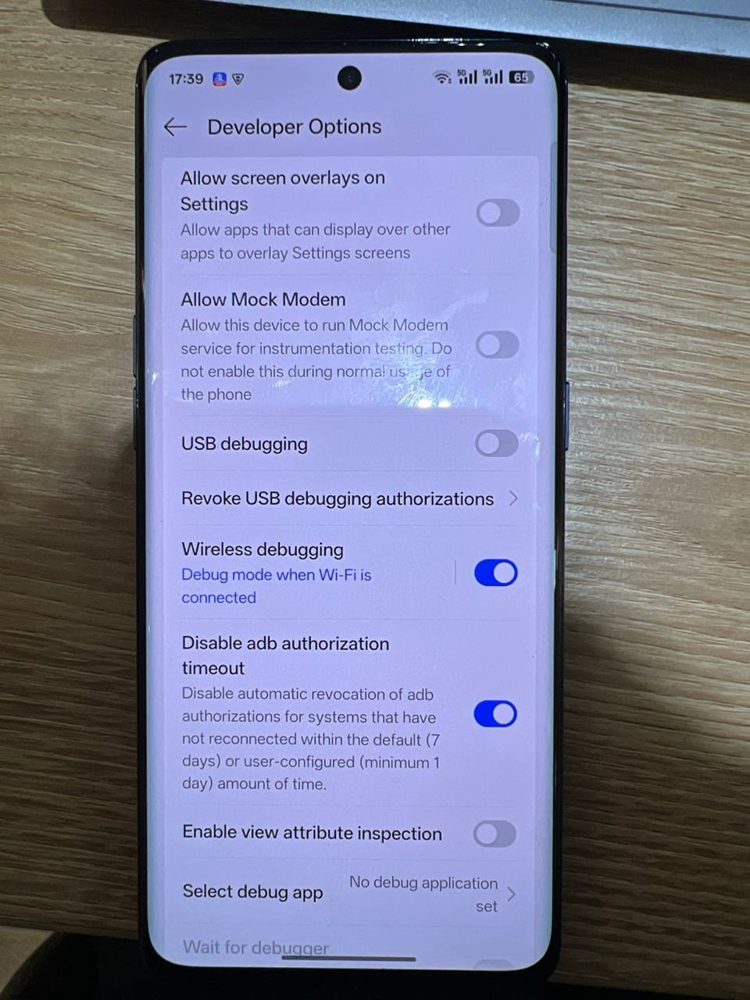

# 主系统 Debloat 记录

## 概述

在主系统（User 0）中禁用/挂起高隐私风险的OPPO系统应用，包括AI功能、浏览器和广告SDK。

**执行日期**: 2026-02-12
**设备**: OPPO Reno9 5G / ColorOS 15
**连接方式**: WiFi调试（ADB over WiFi）

---

## ADB连接

### WiFi调试配置

```bash
# 1. 在主系统中启用开发者选项
#    设置 → 关于手机 → 版本信息 → 连续点击"版本号"7次

# 2. 启用无线调试
#    开发者选项 → 无线调试 → 开启

# 3. 配对并连接
adb pair <手机IP>:<配对端口>    # 输入配对码
adb connect <手机IP>:<连接端口>

# 4. 验证连接
adb devices
adb shell am get-current-user  # 输出0=主系统, 10=系统分身
```

### 已知问题

- **WiFi调试频繁断开**: ADB授权默认会在7天未连接后自动撤销，且连接可能因超时中断
- **解决方法**:
  - 开发者选项 → **Disable adb authorization timeout** → 开启
  - 该选项禁用ADB授权的自动撤销机制（默认7天，最短1天）
  - 调试期间建议同时开启"不锁定屏幕"

  

---

## Debloat 执行记录

### 目标分类

| 类别 | 包名 | 说明 |
|------|------|------|
| AI功能 | `com.oplus.aiunit` | AI单元 |
| AI功能 | `com.oplus.deepthinker` | AI行为分析 |
| AI功能 | `com.oplus.obrain` | AI大脑引擎 |
| AI功能 | `com.aiunit.aon` | AI Always-On |
| 语音 | `com.heytap.speechassist` | OPPO语音助手 |
| 语音 | `com.yuemeng.speechsuite` | 语音套件 |
| 浏览器 | `com.heytap.browser` | OPPO浏览器 |
| 广告 | `com.opos.ads` | OPPO广告SDK |

### 执行结果

#### 成功禁用（disabled-user）

```bash
adb shell pm disable-user --user 0 com.oplus.deepthinker    # ✅ disabled-user
adb shell pm disable-user --user 0 com.oplus.obrain         # ✅ disabled-user
adb shell pm disable-user --user 0 com.aiunit.aon           # ✅ disabled-user
adb shell pm disable-user --user 0 com.heytap.speechassist  # ✅ disabled-user
adb shell pm disable-user --user 0 com.yuemeng.speechsuite  # ✅ disabled-user
```

#### 系统保护包 — 通过 suspend 挂起

以下3个包被ColorOS标记为核心依赖，`disable-user` 返回 `default`（拒绝），`uninstall --user 0` 返回 `DELETE_FAILED_INTERNAL_ERROR`，`pm clear` 被 `OplusClearDataProtectManager` 拦截。

最终通过 `pm suspend` 成功挂起：

```bash
adb shell pm suspend --user 0 com.heytap.browser   # ✅ suspended
adb shell pm suspend --user 0 com.oplus.aiunit      # ✅ suspended
adb shell pm suspend --user 0 com.opos.ads           # ✅ suspended
```

### 最终状态汇总

| 包名 | disable-user | uninstall | pm clear | suspend | 最终状态 |
|------|:---:|:---:|:---:|:---:|------|
| `com.oplus.deepthinker` | ✅ | - | - | - | **已禁用** |
| `com.oplus.obrain` | ✅ | - | - | - | **已禁用** |
| `com.aiunit.aon` | ✅ | - | - | - | **已禁用** |
| `com.heytap.speechassist` | ✅ | - | - | - | **已禁用** |
| `com.yuemeng.speechsuite` | ✅ | - | - | - | **已禁用** |
| `com.heytap.browser` | ❌ default | ❌ 拦截 | ❌ 拦截 | ✅ | **已挂起** |
| `com.oplus.aiunit` | ❌ default | ❌ 拦截 | ❌ 拦截 | ✅ | **已挂起** |
| `com.opos.ads` | ❌ default | ❌ 拦截 | ❌ 拦截 | ✅ | **已挂起** |

---

## ColorOS 保护机制分析

### 三层防护

1. **`pm disable-user` 拦截**: 部分包返回 `default` 而非 `disabled-user`，表示系统拒绝禁用
2. **`pm uninstall --user 0` 拦截**: 返回 `DELETE_FAILED_INTERNAL_ERROR`，系统级保护
3. **`pm clear` 拦截**: `OplusClearDataProtectManager` 抛出 `SecurityException`，专门阻止ADB清除数据

```
java.lang.SecurityException: adb clearing user data is forbidden.
  at com.android.server.pm.OplusClearDataProtectManager
      .interceptClearUserDataIfNeeded(OplusClearDataProtectManager.java:123)
```

### 绕过策略

| 方法 | 说明 | 适用场景 |
|------|------|---------|
| `pm disable-user` | 标准禁用，最温和 | 大部分系统应用 |
| `pm uninstall --user 0` | 从当前用户卸载 | 非核心保护包 |
| `pm suspend` | 挂起应用，无法运行/接收广播 | 被前两种方法拦截的顽固包 |
| Root + Magisk | 可彻底删除系统分区文件 | 需解锁Bootloader（本设备不可用） |

---

## 回滚方法

如果需要恢复被禁用/挂起的包：

```bash
# 恢复被禁用的包
adb shell pm enable --user 0 com.oplus.deepthinker
adb shell pm enable --user 0 com.oplus.obrain
adb shell pm enable --user 0 com.aiunit.aon
adb shell pm enable --user 0 com.heytap.speechassist
adb shell pm enable --user 0 com.yuemeng.speechsuite

# 解除挂起的包
adb shell pm unsuspend --user 0 com.heytap.browser
adb shell pm unsuspend --user 0 com.oplus.aiunit
adb shell pm unsuspend --user 0 com.opos.ads
```

---

## 输入法替换记录 (2026-02-13)

### 安装 Gboard 替代搜狗输入法

**背景**: 系统预装搜狗输入法（`com.sohu.inputmethod.sogouoem`）具备云端上传和 AI 语义分析能力，存在严重隐私风险。

**安装流程**:

1. **获取 APK**: 从 APKPure 下载 XAPK 格式的安装包
   - 版本: `Gboard 16.7.4.861137547-release-arm64-v8a`
   - 来源: https://apkpure.com/gboard-the-google-keyboard-app/com.google.android.inputmethod.latin

2. **XAPK 安装方法**: XAPK 是 ZIP 格式的 split APK 包，需解压后使用 `adb install-multiple`
   ```bash
   # 解压 XAPK
   unzip Gboard_xxx.xapk -d gboard_extracted/

   # 通过 ADB 安装 split APK
   adb install-multiple -r \
     gboard_extracted/com.google.android.inputmethod.latin.apk \
     gboard_extracted/config.xxxhdpi.apk
   ```

3. **启用 Gboard 为输入法**:
   ```bash
   # 启用
   adb shell ime enable com.google.android.inputmethod.latin/com.android.inputmethod.latin.LatinIME

   # 在手机上设为默认: 设置 → 系统设置 → 键盘和输入法 → 选择 Gboard
   ```

4. **下载中文语言包**: 在 Gboard 设置中添加中文（简体）

5. **卸载搜狗输入法**:
   ```bash
   adb shell pm uninstall --user 0 com.sohu.inputmethod.sogouoem  # ✅ Success
   ```

6. **验证**: 确认仅剩 Gboard
   ```bash
   adb shell ime list -s
   # com.google.android.inputmethod.latin/com.android.inputmethod.latin.LatinIME
   ```

### 注意事项

- XAPK 不能直接 `adb install`，必须解压后用 `adb install-multiple`
- 安装 Gboard 后需先在手机上手动切换为默认输入法，再卸载搜狗
- 建议在 Gboard 设置中关闭"使用情况统计"等可选的数据收集项

---

## 待办事项

- [ ] 在系统分身（User 10）中执行更全面的debloat
- [ ] 禁用遥测组件（`com.oplus.statistics.rom`, `com.nearme.statistics.rom`）
- [ ] 禁用安全中心相关组件（`com.oplus.safecenter`, `com.coloros.safesdkproxy`）
- [x] ~~安装替代应用（Firefox, Gboard）后禁用系统浏览器和输入法~~ Gboard 已完成，Firefox 待安装
- [ ] 系统更新后检查被禁用的包是否被重新启用

---

**最后更新**: 2026-02-13
