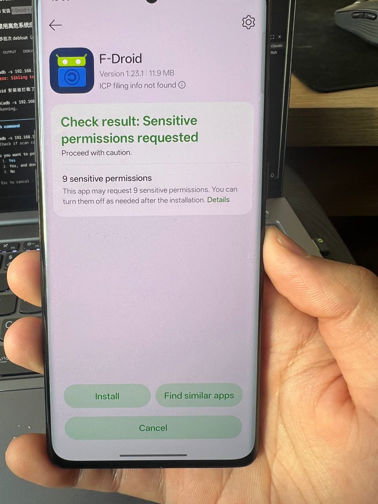
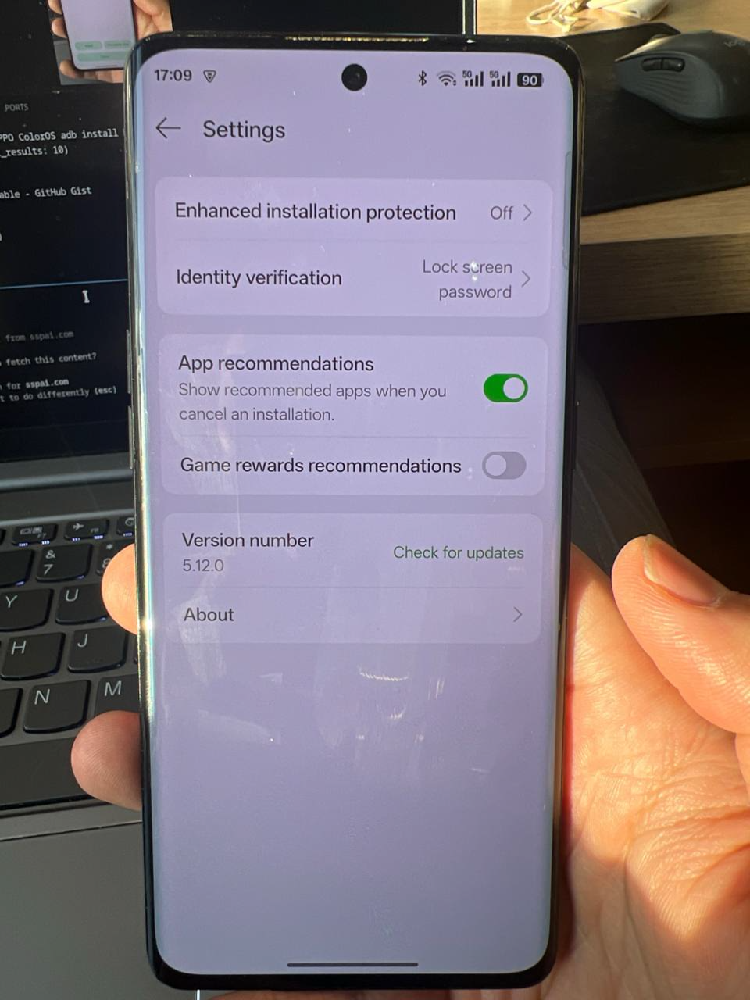

# 待解决问题：OPPO 安装扫描无法完全禁用

**状态**: 🟡 部分解决
**日期**: 2026-02-14 ~ 2026-02-17
**设备**: OPPO Reno9 5G / ColorOS 15

---

## 问题描述

通过 ADB 安装 F-Droid APK 时，即使已禁用 `com.oplus.athena` 和 `com.coloros.securityguard`，OPPO 安装安全扫描弹窗仍然出现，显示 "Check result: Sensitive permissions requested"。





### 复现步骤

```bash
# 1. 确认扫描组件已禁用
adb shell pm list packages -d | grep -E "athena|securityguard"
# 输出:
# package:com.oplus.athena
# package:com.coloros.securityguard

# 2. 执行安装
adb install -r F-Droid.apk

# 3. 手机上弹出安全扫描页面，需手动点击 "Install" 才能继续
```

---

## 调查结果

### 根因分析

ColorOS 的安装验证是**多组件协作的链式机制**，并非单个组件控制：

```
adb install
  → ColorOS 定制版 PackageInstaller（com.android.packageinstaller，已被 OPPO 魔改）
    → 调用 com.oplus.safecenter 执行安全扫描
      → 显示扫描结果弹窗
```

禁用 `com.oplus.athena`（云端哈希扫描）和 `com.coloros.securityguard`（安全检查）只是去掉了链条中的辅助组件。**真正的调度中心 `com.oplus.safecenter` 具有系统最高级保护**，`pm disable-user`、`pm uninstall -k --user 0`、`pm clear` 三种非 root 方法均被系统拦截。

### 组件状态汇总

| 组件 | 角色 | 状态 | 备注 |
|------|------|------|------|
| `com.oplus.athena` | 云端 APK 哈希扫描 | ✅ 已禁用 | `pm disable-user` 成功 |
| `com.coloros.securityguard` | 安装时安全检查 | ✅ 已禁用 | `pm disable-user` 成功 |
| `com.oplus.safecenter` | 安全中心（总调度） | ❌ 无法禁用 | 系统保护，三种方法均失败 |
| `com.oplus.appdetail` | 应用详情/验证 UI | ✅ 已禁用 | `pm disable-user` 成功 |
| `com.android.packageinstaller` | 安装器（OPPO 魔改） | ❌ 不可禁用 | 禁用后无法安装任何应用 |

### 相关安装器组件全列表

```bash
adb shell pm list packages | grep -iE "athena|installer|verify|guard|safe|security|scan"
# 输出:
# com.oplus.safecenter
# com.coloros.securityguard
# com.android.packageinstaller
# com.oplus.athena
# com.oplus.securitypermission
# com.coloros.remoteguardservice
# com.oplus.securitykeyboard
# com.coloros.ocrscanner
# com.android.certinstaller
# com.android.safetycenter.resources
# com.android.safetycenter.resources.overlay
# com.android.safetycenter.styles.overlay
```

---

## 待尝试的解决方案

### 方案 A：禁用 `com.oplus.appdetail`（优先级高）

该组件可能是显示扫描结果 UI 的实际载体。

```bash
adb shell pm disable-user --user 0 com.oplus.appdetail
```

### 方案 B：关闭系统级验证开关

通过开发者选项和 ADB 设置双管齐下：

1. 手机端：设置 → 开发者选项 → 关闭 "Verify apps over USB"
2. ADB 命令：

```bash
adb shell settings put global verifier_verify_adb_installs 0
adb shell settings put global package_verifier_enable 0
```

### 方案 C：开发者选项 "禁止权限监控"

少数派文章验证的方法：

1. 设置 → 其他设置 → 开发者选项
2. 找到并开启 "**禁止权限监控**"
3. 原理：禁用手机管家中的"权限隐私 → 权限管理"功能

> 完成操作后建议关闭此选项恢复安全防护，已授予的权限不会被撤销。

### 方案 D：`pm uninstall` 替代 `pm disable-user`

TheDroidWin 指南建议使用 `pm uninstall`（比 `disable-user` 更彻底）：

```bash
adb shell pm uninstall --user 0 com.oplus.appdetail
adb shell pm uninstall --user 0 com.coloros.securityguard
# com.oplus.safecenter 大概率仍会被拦截
```

恢复方法：`adb shell cmd package install-existing <package_name>`

---

## 参考资料

- [少数派 - ColorOS 免 root 玩机](https://sspai.com/post/67110) — "禁止权限监控"方法
- [TheDroidWin - Disable App Verification on ColorOS](https://thedroidwin.com/how-to-disable-app-verification-on-coloros/) — 禁用三组件方案
- [StackOverflow - INSTALL_FAILED_VERIFICATION_FAILURE](https://stackoverflow.com/questions/15014519) — `verifier_verify_adb_installs` 设置
- [GitHub Gist - OPPO ColorOS Bloatware Disable](https://gist.github.com/eusonlito/adf335aeac5815543e9b9f023f776893) — 完整精简列表
- [V2EX - OPPO 强制禁止安装第三方应用](https://www.v2ex.com/t/1145825) — 社区讨论

---

---

## 2026-02-17 验证记录

### 方案 A 执行结果

```bash
adb shell pm disable-user --user 0 com.oplus.appdetail  # ✅ disabled-user
```

禁用后通过 ADB 安装 F-Droid 和 AuroraStore，**"Sensitive permissions requested" 警告页已消失**，但安装器底部仍显示 "Installation secured by Smart Shield"（`com.oplus.safecenter` 仍在运行）。

### APK 完整性校验

**验证方法**: 对比本地原始 APK 与从设备拉取的已安装 APK 的 SHA-256 哈希及签名证书。

**工具**: `apksigner`（Android SDK build-tools 36.0.0）+ OpenJDK 21

#### F-Droid

| 验证项 | 本地原始 | 设备安装后 | 结果 |
|--------|----------|------------|------|
| SHA-256 | `1dfce4269081693f10350dbabd26991a59d7c2bb81f870de54e5b113f4785b7a` | 同左 | **一致** |
| 签名者 DN | CN=Ciaran Gultnieks, OU=Unknown, O=Unknown, L=Wetherby, ST=Unknown, C=UK | 同左 | **一致** |
| 证书 SHA-256 | `43238d512c1e5eb2d6569f4a3afbf5523418b82e0a3ed1552770abb9a9c9ccab` | 同左 | **一致** |

#### AuroraStore

| 验证项 | 本地原始 | 设备安装后 | 结果 |
|--------|----------|------------|------|
| SHA-256 | `462b3adfa59f158d786030cbb51c973263390dc8dd25c1f37233e246338252b1` | 同左 | **一致** |
| 签名者 DN | CN=Rahul Patel, OU=UI/UX, O=Drragons-CAF, L=Bengaluru, ST=Karnataka, C=IN | 同左 | **一致** |
| 证书 SHA-256 | `4c626157ad02bda3401a7263555f68a79663fc3e13a4d4369a12570941aa280f` | 同左 | **一致** |

### 结论

- **Smart Shield 扫描为只读操作**，不会修改、替换或注入内容到 APK 中
- 安装到设备上的 APK 与本地文件二进制完全一致，签名证书均为官方原始签名
- `com.oplus.safecenter` 虽然无法禁用，但其"安全扫描"功能不影响 APK 完整性
- 方案 B/C/D 暂不需要继续尝试，当前状态可接受

### 方案 B 补充执行

```bash
adb shell settings put global package_verifier_enable 0  # ✅ 已设置
adb shell settings put global verifier_verify_adb_installs 0  # ✅ 之前已设置
```

### `com.oplus.safecenter` 深入调研（2026-02-17）

经搜索 XDA、GitHub (Canta)、Reddit 等多个来源，**确认非 root 环境下无法禁用**：

- ColorOS 框架层内置 `OplusForbidUninstallAppManager` 和 `OplusForbidHideOrDisableManager` 两个拦截器，专门保护核心包
- `pm disable-user`、`pm uninstall --user 0`、`pm suspend` 三种方法均被框架层拦截
- **Canta + Shizuku** 同样无效 — Canta 官方 README 明确说明 "Some oplus apps are known to be stubborn and don't allow uninstallations"，底层调用的是同一套 PackageManager API
- XDA 有人通过卸载 `com.oplus.appplatform` 解除部分保护（浏览器/应用商店），但有 bootloop 风险，且无人报告此方法能解锁 `safecenter`

**结论**: `com.oplus.safecenter` 仅 root 可处理（本设备 Bootloader 锁定，不可用）

### 剩余风险与缓解

- `com.oplus.safecenter` 仍在运行，可能将安装行为（包名、哈希）上报至 OPPO 云端
- **缓解措施**: 通过网络层（DNS/防火墙）阻断 OPPO 遥测域名，使 `safecenter` 即使运行也无法上报数据

---

**最后更新**: 2026-02-17
